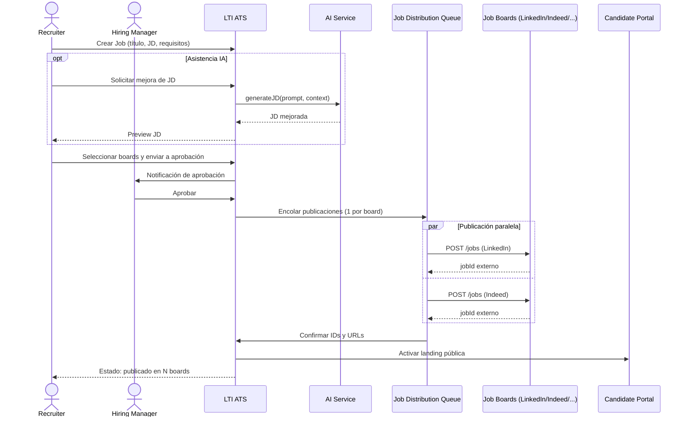
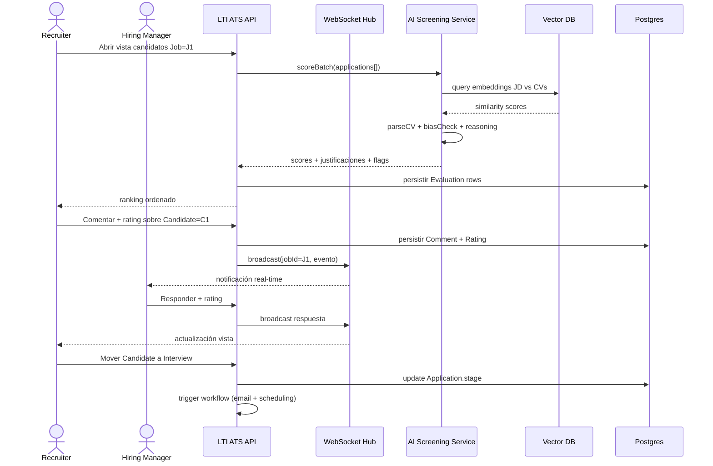
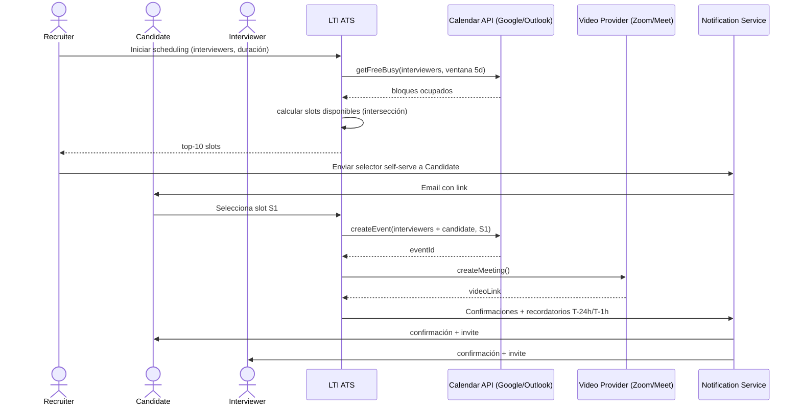
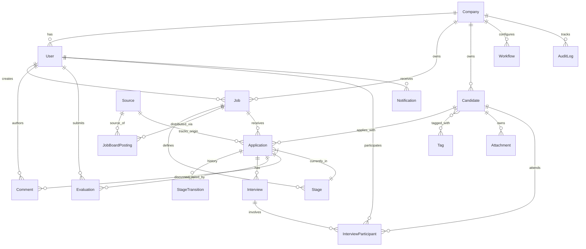
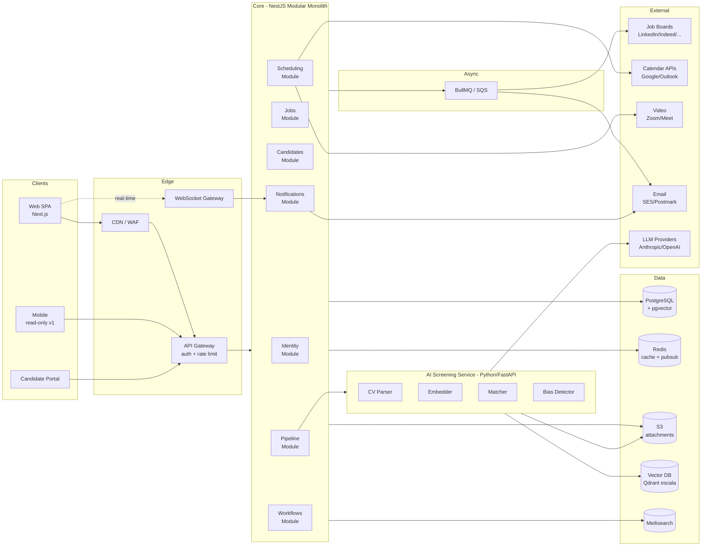
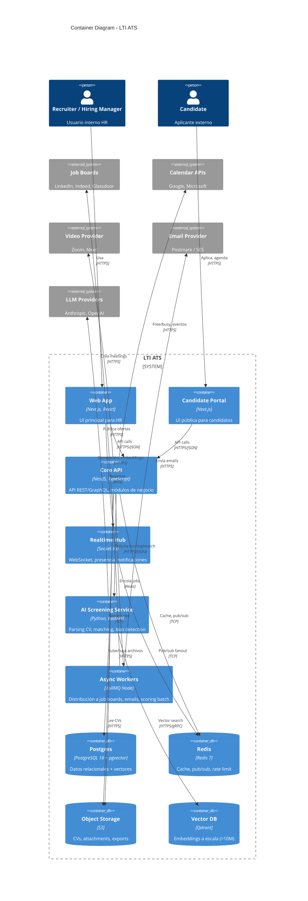

# LTI - Applicant Tracking System (Diseño v0.1)

> Autor: Facundo Ferrari (FF) · Fecha: 2026-05-07 · Bootcamp AI4Devs-design-1

## Tabla de contenidos

1. [Descripción y propuesta de valor](#1-descripción-y-propuesta-de-valor)
2. [Funciones principales](#2-funciones-principales)
3. [Lean Canvas](#3-lean-canvas)
4. [Casos de uso principales](#4-casos-de-uso-principales)
   - 4.1 [UC-1 Publicar y distribuir oferta](#41-uc-1-publicar-y-distribuir-oferta)
   - 4.2 [UC-2 Screening asistido por IA + colaboración](#42-uc-2-screening-asistido-por-ia--colaboración)
   - 4.3 [UC-3 Programación de entrevistas](#43-uc-3-programación-de-entrevistas)
5. [Modelo de datos](#5-modelo-de-datos)
6. [Diseño de alto nivel](#6-diseño-de-alto-nivel)
7. [Diagrama C4 — AI Screening Service](#7-diagrama-c4--ai-screening-service)
8. [Anexos](#8-anexos)
9. [Anexo: prompts utilizados](#9-anexo-prompts-utilizados)

---

## 1. Descripción y propuesta de valor

**LTI** es un Applicant Tracking System (ATS) de nueva generación pensado para equipos de Talent Acquisition que quieren reducir time-to-hire y elevar la calidad del proceso de contratación combinando automatización, colaboración en tiempo real y asistencia de IA en cada etapa del pipeline. A diferencia de los ATS tradicionales (heredados de los años 2000, centrados en compliance y archivado), LTI nace cloud-native, multi-tenant y con la capa de IA como ciudadano de primera clase: parsing de CVs, matching candidato↔puesto, generación de job descriptions, detección de sesgo y resumen de entrevistas vienen integrados, no como add-on.

### Propuesta de valor (1 párrafo)

> "LTI permite a equipos de HR contratar 2× más rápido y con mejor fit cultural, automatizando el trabajo administrativo, conectando a reclutadores y hiring managers en tiempo real, e incorporando IA para decisiones más informadas y sin sesgo — todo en una sola plataforma con integraciones nativas a job boards, calendarios y herramientas de comunicación."

### Ventajas competitivas

- **Eficiencia operativa para HR:** distribución multi-board en un click, deduplicación automática de candidatos, scoring inicial automatizado → reducción medible del time-to-hire (target: -40% vs benchmark Greenhouse).
- **Colaboración real-time recruiter ↔ hiring manager:** comentarios, ratings y decisiones compartidas con presencia tipo Figma; reducción de ciclos de feedback de días a minutos.
- **Automatización de workflows:** triggers configurables (estado de candidato, SLA, eventos externos) que disparan emails, mover de stage, asignaciones, integraciones — sin código.
- **IA integrada por diseño:** resumen de CVs, matching semántico con vector search, generación de JDs, redacción de feedback, detección de sesgo en lenguaje y decisiones — no es un módulo extra, es transversal.
- **Experiencia candidate-first:** portal moderno, transparencia de estado, comunicación proactiva — reduce drop-off del candidato (target: +25% conversion en pipeline).
- **Compliance GDPR/EEO nativo:** retención configurable, anonimización para reducir sesgo, auditoría completa — listo para EU, UK y mercados regulados.

---

## 2. Funciones principales

| # | Función | Descripción breve |
|---|---------|-------------------|
| 1 | **Job posting & multi-board distribution** | Crear ofertas y publicarlas con un click en LinkedIn, Indeed, Glassdoor, job boards locales y portal propio; tracking unificado de fuente. |
| 2 | **Candidate sourcing & CRM** | Importación de candidatos (LinkedIn, CSV, referrals), base de talento reutilizable, deduplicación automática por email + fingerprint. |
| 3 | **Pipeline kanban configurable** | Stages personalizables por puesto (Sourced → Screening → Interview → Offer → Hired), drag-and-drop, SLA por stage, vistas filtradas. |
| 4 | **AI screening & matching** | Parser de CV, embeddings, scoring de match candidato↔puesto, ranking automático, justificación textual generada por LLM. |
| 5 | **Real-time collaboration** | Comentarios en perfil de candidato, ratings consensuados (1-5), decisiones grupales, presencia de usuarios online (estilo Figma/Notion). |
| 6 | **Interview scheduling** | Sincronización con Google Calendar / Outlook, slots disponibles compartidos, auto-envío de invitaciones, recordatorios y links de videollamada. |
| 7 | **Analytics & reporting** | Dashboard de funnel (conversión por stage), time-to-hire, cost-per-hire, fuente más efectiva, diversity metrics. |
| 8 | **Compliance & GDPR** | Retención configurable, derecho al olvido, audit log inmutable, anonimización opcional para fases iniciales (reducir sesgo). |

---

## 3. Lean Canvas

| **Problem** | **Solution** | **Unique Value Proposition** | **Unfair Advantage** | **Customer Segments** |
|---|---|---|---|---|
| 1. ATS legacy lentos y poco colaborativos. 2. Reclutadores pierden 60% del tiempo en tareas administrativas. 3. Decisiones sesgadas y poco trazables. 4. Integraciones con job boards/calendarios fragmentadas. | ATS cloud-native con IA integrada, colaboración real-time, automatización por workflows y distribución multi-board con un click. | "Contrata 2× más rápido con mejor fit, sin sesgo y con tu equipo alineado en tiempo real." | Stack IA propio + capa de embeddings sobre vector DB + datasets etiquetados de hiring; UX moderna inspirada en Figma/Linear. | Scale-ups y mid-market (50-2000 empleados) en SaaS, fintech, consultoras tech; HR teams con 2-20 reclutadores; mercados EU/LATAM con foco GDPR. |
| **Key Metrics** | **Channels** | | | **Cost Structure** |
| - Time-to-hire (target ≤ 21 días). - Activation: % cuentas con ≥1 oferta publicada en 7 días. - Retention: NRR ≥ 115%. - AI usage: % candidatos con score IA usado en decisión. | Inbound (SEO + content sobre hiring), partnerships con HR consultancies, marketplace de Greenhouse/Workday alternatives, eventos HR-tech, programa de referidos. | | | Infra cloud (DB, vector store, queue, CDN), licencias LLM (OpenAI/Anthropic), staff (eng, sales, CS), compliance/legal, marketing. |
| | | **Revenue Streams** | | |
| | | Suscripción SaaS por seat/mes (tiers Starter / Growth / Enterprise), add-on AI usage-based, marketplace de integraciones premium, módulo de assessments. | | |

> **Nota:** los 9 bloques estándar Lean Canvas (Problem, Customer Segments, UVP, Solution, Channels, Revenue Streams, Cost Structure, Key Metrics, Unfair Advantage) están todos cubiertos en la tabla anterior, agrupados de forma legible en markdown.

---

## 4. Casos de uso principales

### 4.1 UC-1 Publicar y distribuir oferta

- **Actor primario:** Recruiter
- **Actores secundarios:** Hiring Manager (aprobador), Job Boards externos (LinkedIn, Indeed)
- **Precondición:** Recruiter autenticado con permisos sobre el `Company`. Plantilla de JD opcional disponible.
- **Postcondición:** Oferta publicada en N job boards, candidate landing page activa, tracking de fuentes habilitado.

**Flujo principal:**

1. Recruiter crea nueva oferta (`Job`) con título, descripción, requisitos, ubicación.
2. (Opcional) Solicita asistencia de IA para generar/mejorar JD → sistema invoca AI Service.
3. Recruiter selecciona job boards destino y configura visibilidad/precio.
4. Hiring Manager recibe notificación de revisión y aprueba.
5. ATS dispara publicación asíncrona a cada job board vía API/queue.
6. Job boards confirman publicación; sistema almacena IDs externos y URLs.
7. Sistema genera landing pública en portal LTI con UTM tracking por board.
8. Notificación de éxito al Recruiter; dashboard muestra estados por board.

**Flujos alternativos:**

- **3a.** Hiring Manager rechaza JD → vuelve a step 1 con comentarios.
- **5a.** Falla publicación en un board → retry con backoff; tras N fallos, alerta al Recruiter; los demás boards continúan.
- **7a.** Job board no devuelve URL canónica → fallback a landing interna LTI.

**Diagrama:**



---

### 4.2 UC-2 Screening asistido por IA + colaboración

- **Actor primario:** Recruiter
- **Actores secundarios:** Hiring Manager, AI Service, sistema de notificaciones real-time
- **Precondición:** Existen candidatos (`Candidate` + `Application`) en stage "Screening" para un `Job` activo.
- **Postcondición:** Candidatos rankeados por score IA; recruiter y manager alinean decisiones (avanzar / rechazar) con trazabilidad completa.

**Flujo principal:**

1. Recruiter abre vista de candidatos del Job.
2. Sistema dispara batch de scoring IA para candidatos sin score reciente.
3. AI Service parsea CVs (extrae skills, experiencia), genera embeddings, calcula match contra JD embedding.
4. AI Service devuelve score (0-100) + justificación textual + flags de sesgo potencial.
5. Recruiter ve ranking, abre perfil de candidato top-1.
6. Recruiter deja comentario "buen fit en backend, falta exposure cloud" + rating 4/5.
7. Hiring Manager (presencia online) ve el comentario en tiempo real vía WebSocket, responde "ok para entrevista técnica" + rating 4/5.
8. Recruiter aplica acción "mover a Interview" → trigger de workflow envía invitación al candidato.
9. Audit log registra: scoring IA, comentarios, ratings, decisión, autores y timestamps.

**Flujos alternativos:**

- **4a.** AI Service no disponible → mostrar candidatos sin score, banner "scoring en cola"; reintentar background.
- **4b.** Score < umbral configurable → marcar como "low match" con flag visual; no auto-rechazar (decisión humana).
- **7a.** Manager offline → comentario queda persistido, push notification + email; flujo continúa cuando responde.

**Diagrama:**



---

### 4.3 UC-3 Programación de entrevistas

- **Actor primario:** Recruiter
- **Actores secundarios:** Candidate, Interviewer(s), Calendar Provider (Google/Outlook), Video Provider (Zoom/Meet)
- **Precondición:** Candidato en stage "Interview"; interviewers tienen calendario conectado a LTI.
- **Postcondición:** Entrevista creada en calendarios de todos los participantes, link de video generado, recordatorios programados.

**Flujo principal:**

1. Recruiter elige `Application` y abre módulo "Schedule Interview".
2. Recruiter selecciona interviewers (1-N) y duración (e.g. 45 min).
3. ATS consulta disponibilidad real-time vía Calendar API (free/busy) en próxima ventana de 5 días.
4. ATS calcula slots intersección y muestra top-10 al Recruiter.
5. Recruiter envía slots al Candidato (email con selector self-serve) o reserva directo.
6. Candidato selecciona slot → ATS confirma con interviewers.
7. ATS crea evento en cada calendario via API, genera link de video, persiste `Interview` con metadatos.
8. ATS envía confirmación + recordatorios T-24h y T-1h vía email.

**Flujos alternativos:**

- **3a.** Calendar API rate-limited → caché local + fallback con disclaimer "puede haber conflictos".
- **5a.** Candidato no responde en 48h → reminder automático + escalado al Recruiter.
- **7a.** Conflicto de calendario detectado en último momento → cancelar evento, notificar a todos, reabrir flujo.

**Diagrama:**



---

## 5. Modelo de datos

### Entidades principales

| Entidad | Atributos clave (tipo) | Notas |
|---------|------------------------|-------|
| **Company** | `id: UUID PK`, `name: String`, `domain: String`, `plan: Enum`, `created_at: Timestamp`, `settings: JSONB` | Tenant raíz; aislamiento multi-tenant. |
| **User** | `id: UUID PK`, `company_id: UUID FK`, `email: String unique`, `name: String`, `role: Enum(Admin,Recruiter,HiringManager,Interviewer)`, `password_hash: String`, `oauth_provider: String?`, `last_login: Timestamp` | Multi-rol vía tabla `UserRole` si requerimos N roles por user. |
| **Job** | `id: UUID PK`, `company_id: UUID FK`, `title: String`, `description: Text`, `requirements: Text`, `location: String`, `remote_type: Enum(Onsite,Hybrid,Remote)`, `salary_min/max: Decimal`, `status: Enum(Draft,Open,Paused,Closed)`, `embedding: Vector(1536)`, `created_by: UUID FK→User`, `published_at: Timestamp` | `embedding` para matching semántico (pgvector o vector DB externa). |
| **JobBoardPosting** | `id: UUID PK`, `job_id: UUID FK`, `source_id: UUID FK→Source`, `external_id: String`, `external_url: String`, `status: Enum(Pending,Live,Failed,Expired)`, `posted_at: Timestamp` | 1 Job → N postings (1 por board). |
| **Source** | `id: UUID PK`, `name: String`, `type: Enum(JobBoard,Referral,Direct,Import)`, `config: JSONB` | Catálogo de fuentes. |
| **Candidate** | `id: UUID PK`, `company_id: UUID FK`, `email: String`, `first_name: String`, `last_name: String`, `phone: String?`, `linkedin_url: String?`, `current_role: String?`, `tags: String[]`, `consent_given_at: Timestamp`, `consent_expires_at: Timestamp` | Deduplicación por `(company_id, email)` único + fingerprint. |
| **Application** | `id: UUID PK`, `candidate_id: UUID FK`, `job_id: UUID FK`, `source_id: UUID FK`, `current_stage_id: UUID FK→Stage`, `status: Enum(Active,Rejected,Withdrawn,Hired)`, `applied_at: Timestamp`, `score_ai: Decimal?`, `cv_attachment_id: UUID FK→Attachment` | N:M entre Candidate y Job vía Application. |
| **Stage** | `id: UUID PK`, `job_id: UUID FK`, `name: String`, `order: Integer`, `sla_hours: Integer?`, `is_terminal: Boolean` | Stages personalizables por Job. |
| **StageTransition** | `id: UUID PK`, `application_id: UUID FK`, `from_stage_id: UUID FK?`, `to_stage_id: UUID FK`, `actor_id: UUID FK→User`, `reason: Text?`, `at: Timestamp` | Historial de movimientos (audit). |
| **Interview** | `id: UUID PK`, `application_id: UUID FK`, `scheduled_at: Timestamp`, `duration_min: Integer`, `mode: Enum(Onsite,Video,Phone)`, `video_link: String?`, `calendar_event_ids: JSONB`, `status: Enum(Scheduled,Done,Canceled,NoShow)` | |
| **InterviewParticipant** | `id: UUID PK`, `interview_id: UUID FK`, `user_id: UUID FK?`, `candidate_id: UUID FK?`, `role: Enum(Interviewer,Candidate,Observer)` | N:M Interview ↔ User/Candidate. |
| **Evaluation** | `id: UUID PK`, `application_id: UUID FK`, `interview_id: UUID FK?`, `evaluator_id: UUID FK→User`, `rating: Integer(1-5)`, `recommendation: Enum(StrongHire,Hire,Neutral,NoHire,StrongNoHire)`, `notes: Text`, `competencies: JSONB`, `submitted_at: Timestamp` | |
| **Comment** | `id: UUID PK`, `application_id: UUID FK`, `author_id: UUID FK→User`, `body: Text`, `mentions: UUID[]`, `created_at: Timestamp`, `parent_id: UUID FK?` | Soporta threads y menciones @. |
| **Attachment** | `id: UUID PK`, `owner_type: Enum(Candidate,Application,Job)`, `owner_id: UUID`, `s3_key: String`, `mime_type: String`, `size_bytes: Integer`, `parsed_text: Text?`, `embedding: Vector(1536)?`, `uploaded_at: Timestamp` | CVs, portfolios, attachments genéricos. |
| **Tag** | `id: UUID PK`, `company_id: UUID FK`, `name: String`, `color: String` | |
| **CandidateTag** | `candidate_id: UUID FK`, `tag_id: UUID FK` (PK compuesta) | N:M. |
| **Notification** | `id: UUID PK`, `user_id: UUID FK`, `type: Enum(Mention,StageChange,InterviewInvite,...)`, `payload: JSONB`, `read_at: Timestamp?`, `created_at: Timestamp` | |
| **Workflow** | `id: UUID PK`, `company_id: UUID FK`, `trigger: JSONB`, `actions: JSONB`, `enabled: Boolean` | Automatizaciones declarativas. |
| **AuditLog** | `id: UUID PK`, `company_id: UUID FK`, `actor_id: UUID FK?`, `entity_type: String`, `entity_id: UUID`, `action: String`, `diff: JSONB`, `at: Timestamp` | Inmutable (append-only). |

> **Multi-tenancy:** todas las entidades de negocio cuelgan de `company_id` con índice. Row-level security en Postgres como segunda barrera.
> **Soft delete:** convención `deleted_at: Timestamp?` en entidades sensibles (Candidate, Application, Job, Comment).

### Diagrama ER



---

## 6. Diseño de alto nivel

### Estilo arquitectónico

**Modular monolith con bordes preparados para extracción a microservicios.** Justificación:

- Greenfield + equipo inicial pequeño → microservicios desde día 1 introduce overhead operacional (deploys, observabilidad distribuida, contratos) que ralentiza descubrimiento de producto.
- Bounded contexts bien definidos (Identity, Jobs, Candidates, Pipeline, Scheduling, AI, Notifications) viven como módulos del monolito con APIs internas claras.
- Cuando un módulo justifica escalado/lenguaje propio (ej. AI Service en Python) o equipo dedicado, se extrae sin reescribir.
- Vector DB, queue y AI service ya son externos desde inicio (capacidades especializadas).

### Stack tentativo

| Capa | Tecnología | Justificación |
|------|------------|---------------|
| Frontend | **Next.js 15 (React 19) + TypeScript + Tailwind + shadcn/ui** | SSR para SEO en landing pública, RSC para perf, ecosistema maduro. |
| Realtime UI | **WebSocket vía Socket.IO o partykit** | Presencia, comentarios live, notificaciones. |
| Backend API | **NestJS (Node 22, TypeScript)** | Modularidad nativa (modules), DI, decoradores; afín al modular monolith. Alternativa: FastAPI si el equipo es Python-first. |
| AI Service | **Python (FastAPI) separado** | Ecosistema ML (embeddings, LangChain, transformers) más maduro en Python; aislado para escalar GPU si requerido. |
| DB primaria | **PostgreSQL 16 + pgvector** | Multi-tenant con RLS, JSONB, vectores in-DB para empezar (pgvector hasta ~10M rows). |
| Vector DB (escala) | **Qdrant o Weaviate** | Cuando pgvector no escale; búsqueda hybrid. |
| Cache | **Redis** | Session store, rate limiting, pub/sub interno. |
| Search full-text | **Meilisearch** o Postgres FTS | Búsqueda de candidatos por skills/notas. |
| Object storage | **S3 (o R2)** | CVs, attachments, exports. |
| Queue / jobs | **BullMQ (Redis) → SQS si escala** | Job distribution, scoring batch, scheduling reminders. |
| LLM provider | **Anthropic Claude + OpenAI fallback** | Calidad + redundancia; abstracción detrás de adapter. |
| Auth | **Auth.js + OAuth2 (Google/Microsoft) + SAML SSO (enterprise)** | Cubre B2B SaaS. |
| Observability | **OpenTelemetry → Grafana Cloud / Datadog** | Trazas distribuidas, métricas, logs. |
| CI/CD | **GitHub Actions + Vercel (front) + Fly.io / AWS ECS (back)** | Deploy rápido, preview envs por PR. |

### Diagrama de alto nivel



### Cross-cutting concerns

- **Auth & multi-tenancy:** OAuth2 + SSO enterprise; `company_id` propagado en JWT y enforced por middleware + Postgres RLS.
- **Observabilidad:** OpenTelemetry end-to-end (front → API → AI service); SLOs por módulo (latency p95, error rate); alertas en error budget burn.
- **GDPR / data residency:** región EU dedicada, DPA, retención configurable por `Company`, derecho al olvido como job asíncrono que cascada (Candidate + Applications + Attachments).
- **Audit log:** inmutable, append-only, accesible por Admin para compliance; export CSV/JSON.
- **Feature flags:** GrowthBook o Unleash para rollouts graduales y experiments.
- **Rate limiting:** Redis token bucket por user + por company en API gateway.

---

## 7. Diagrama C4 — AI Screening Service

### 7.1 Justificación de la elección

El **AI Screening Service** es el componente que más diferencia a LTI de ATS legacy y el que concentra mayor complejidad arquitectónica (múltiples integraciones externas: LLMs, vector DB, parser, queue). Hacer zoom aquí muestra cómo se descompone una capacidad transversal de IA en piezas intercambiables — relevante para evolucionar de un proveedor LLM a otro o de pgvector a Qdrant sin reescribir el servicio.

### 7.2 C4 — Nivel Container (sistema completo)



### 7.3 C4 — Nivel Component (zoom AI Screening Service)

```mermaid
C4Component
    title Component Diagram - AI Screening Service

    Container_Boundary(ai, "AI Screening Service (Python/FastAPI)") {
        Component(api_gw, "API Layer", "FastAPI Routers", "Endpoints REST: /score, /match, /generate-jd, /summarize")
        Component(orchestrator, "Prompt Orchestrator", "Python", "Coordina pipelines: parse → embed → match → bias → reason")
        Component(parser, "CV Parser", "Python + pdfplumber + spaCy", "Extrae texto, entidades (skills, empresas, fechas)")
        Component(embedder, "Embedding Generator", "Python", "Genera embeddings 1536d para CVs y JDs")
        Component(matcher, "Match Scorer", "Python", "Calcula similitud + ajustes por filtros duros (ubicación, salario)")
        Component(bias, "Bias Detector", "Python + reglas + LLM check", "Detecta lenguaje sesgado en JD y feedback")
        Component(reasoner, "Reasoning Generator", "Python", "Justificación textual del score vía LLM")
        Component(vstore, "Vector Store Adapter", "Python", "Abstracción pgvector/Qdrant (interfaz común)")
        Component(llm_client, "LLM Client", "Python", "Adapter Anthropic/OpenAI con retry, fallback y caching")
        Component(cache, "Response Cache", "Python + Redis", "Cachea embeddings y razonamientos por hash de input")
        Component(metrics, "Telemetry", "OpenTelemetry SDK", "Métricas, trazas, logs estructurados")
    }

    ContainerDb_Ext(pg, "Postgres + pgvector", "Embeddings hasta ~10M")
    ContainerDb_Ext(qdrant, "Qdrant", "Vector DB a escala")
    ContainerDb_Ext(s3, "S3", "CVs originales")
    ContainerDb_Ext(redis, "Redis", "Cache responses")
    System_Ext(llm, "LLM Providers", "Anthropic / OpenAI")
    Container_Ext(core, "Core API", "NestJS - cliente del servicio")

    Rel(core, api_gw, "POST /score, /match, /generate-jd", "HTTPS/JSON")
    Rel(api_gw, orchestrator, "Despacha request")
    Rel(orchestrator, parser, "parseCV(s3_key)")
    Rel(parser, s3, "Descarga CV", "HTTPS")
    Rel(orchestrator, embedder, "embed(text)")
    Rel(embedder, llm_client, "embeddings.create")
    Rel(orchestrator, matcher, "score(cv_emb, jd_emb, filters)")
    Rel(matcher, vstore, "knn search")
    Rel(vstore, pg, "SQL pgvector", "TCP")
    Rel(vstore, qdrant, "search API", "gRPC")
    Rel(orchestrator, bias, "checkBias(text)")
    Rel(bias, llm_client, "completion (clasificador)")
    Rel(orchestrator, reasoner, "generateRationale(...)")
    Rel(reasoner, llm_client, "messages.create")
    Rel(llm_client, llm, "API calls", "HTTPS")
    Rel(orchestrator, cache, "get/set hash(input)")
    Rel(cache, redis, "GET/SET", "TCP")
    Rel(api_gw, metrics, "spans + counters")
```



### 7.4 Decisiones notables del componente

- **Adapter de LLM** (`LLM Client`): cambiar de Anthropic a OpenAI o agregar Mistral solo afecta a este componente; el resto opera contra una interfaz común con retry exponencial, circuit breaker y fallback configurable.
- **Vector Store Adapter:** misma estrategia para migrar pgvector → Qdrant cuando el dataset crezca (>10M embeddings o latency p95 > 200ms).
- **Cache de embeddings y razonamientos:** key = `hash(content + model_version)`. Reduce ~60% de llamadas repetidas y aísla del costo de LLM.
- **Bias Detector:** combina reglas deterministas (lista de términos sesgados) con verificación LLM, doble pasada para precisión.
- **Prompt Orchestrator:** pipeline declarativo (YAML por caso de uso) — facilita auditar y versionar prompts; cada step emite spans OTel.

---

## 8. Anexos

### 8.1 Decisiones abiertas / supuestos

- **Multi-tenancy:** se asume schema único con `company_id` + RLS (cost-effective). Schema-per-tenant queda como upgrade para enterprise.
- **GraphQL vs REST:** REST primera versión por simplicidad; GraphQL evaluado si dashboard tiene necesidades de over-fetching.
- **Mobile:** v1 read-only (notificaciones, ver perfiles, comentar). App nativa o PWA — decisión post-validación.
- **Self-hosted LLM:** no en v1. Se evalúa en GA si hay clientes enterprise con requisitos de data residency.
- **Pricing:** seat-based + add-on AI usage; números concretos a validar con primeros 5 clientes.

### 8.2 Roadmap inicial sugerido

| Hito | Alcance | Plazo aprox. |
|------|---------|--------------|
| **MVP Alpha (6 sem)** | Job CRUD, Candidate CRUD, Pipeline básico, AI scoring v1, comentarios async. | Semana 6 |
| **Beta privada (10 sem)** | Real-time collab, distribución multi-board (LinkedIn + Indeed), scheduling con Google Cal. | Semana 10 |
| **GA v1.0 (16 sem)** | Workflows, analytics, GDPR completo, SSO, mobile read-only. | Semana 16 |
| **GA v1.1+** | Vector DB extracción, marketplace integraciones, módulo assessments, self-hosted LLM eval. | Semana 20+ |

### 8.3 Riesgos y mitigaciones

| Riesgo | Impacto | Mitigación |
|--------|---------|------------|
| Costo LLM se dispara | Alto | Cache agresivo, embeddings on-prem en pgvector, presupuesto por company. |
| Cambios breaking en APIs job boards | Medio | Adapter por board + tests de contrato + alerts. |
| GDPR / data leakage | Alto | RLS, encriptación at-rest, DPA, audit trail, pen-tests trimestrales. |
| Bias en IA → reputación / legal | Alto | Bias Detector, opción de anonimizar fases iniciales, override humano siempre. |
| Adopción lenta vs incumbents | Alto | Foco mid-market underserved, programa migración Greenhouse/Lever, free tier 14 días. |

---

## 9. Anexo: prompts utilizados

### 9.1 Modelo y herramientas

- **Asistente:** Claude Opus 4.7 (Anthropic) vía Claude Code CLI.
- **Sesión:** rama `feat/design-ats-lti`, commits trazables en historial git.
- **Renderer Mermaid:** GitHub nativo (verificación visual post-push).

### 9.2 Prompt de contexto inicial

```
Actuá como Product Manager senior + Software Architect senior.
Diseñá la primera versión de LTI, un ATS (Applicant Tracking System) cloud-native
con foco en eficiencia HR, colaboración real-time, automatización e IA integrada.
Entregable: un único documento markdown con descripción + valor, Lean Canvas,
3 casos de uso con diagramas, modelo de datos, diseño de alto nivel y diagrama C4
profundizando en un componente. Idioma español, diagramas Mermaid, sin emojis.
```

### 9.3 Prompts por sección

| Sección | Prompt resumido | Iteraciones |
|---------|-----------------|-------------|
| 1. Valor | "Describí LTI en 1 párrafo + 6 ventajas competitivas ancladas en eficiencia, colaboración, automatización, IA. Métricas concretas donde aplique." | 1 |
| 2. Funciones | "Listá 6-8 funciones principales en tabla, con 1-2 líneas por función, sin marketing fluff." | 1 |
| 3. Lean Canvas | "Completá los 9 bloques estándar Lean Canvas para LTI; bullets concretos y medibles donde aplique." | 2 (ajuste de KPIs) |
| 4. Casos de uso | "Generá 3 UC que cubran los 4 pilares; por cada uno: actor, precondición, flujo principal numerado, alternativos, postcondición, diagrama Mermaid sequence." | 2 (alternativos) |
| 5. Modelo de datos | "Definí ≥10 entidades con atributos tipados y cardinalidades; diagrama Mermaid erDiagram. Considerar multi-tenancy y soft delete." | 2 (entidades adicionales: Workflow, AuditLog) |
| 6. Alto nivel | "Justificá modular monolith vs microservicios; stack tentativo en tabla; diagrama Mermaid flowchart con clientes, edge, core, AI, data, async, externos." | 1 |
| 7. C4 | "Elegí componente más diferenciador; diagramá C4 Container completo y C4 Component zoom con subcomponentes (parser, embedder, matcher, bias, reasoner, adapter, cache)." | 2 (claridad de adapters) |
| 8. Anexos | "Listá decisiones abiertas, roadmap por hitos, riesgos con mitigaciones." | 1 |

### 9.4 Convenciones aplicadas

- Términos técnicos en inglés cuando idiomático (pipeline, stage, sourcing, kanban, webhook, embedding).
- Todos los nombres de entidades, módulos y servicios en inglés (consistencia con código futuro).
- Labels de diagramas en español cuando son descriptivos; nombres de nodos técnicos en inglés.
- Sin emojis en todo el documento (regla de estilo).
- Mermaid como único lenguaje de diagramas; fallback a `flowchart` si C4 falla en algún renderer.
